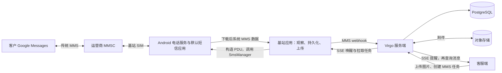

# Google Messages MMS 接入评估与三端改造设计

日期：2026-09-25。性质：基于当前源码的设计评估，尚未实施业务代码改造或完成真机互通验证。

需求更新：当前只需要接收 MMS。实施范围以 [MMS 只接收实施方案](mms-receive-only-implementation.md) 为准；本文出站及 RCS 部分保留为背景，不属于当前开发范围。

## 1. 结论与范围

可以在现有架构上支持与 Google Messages 互通的传统 MMS。服务器已有入站 MMS、附件存储和客服查询能力，主要工作是修复基站入站链路、补齐客服展示，并新增完整的出站 MMS 链路。

这里暂按“客户在 Google Messages 中向基站 SIM 号码发送彩信，客服可以看图并回复图片”设计。首期支持一对一 JPEG/PNG 图片和可选正文；群组 MMS、视频、语音及 RCS 单列后续范围。

Google Messages 同时处理 SMS/MMS 和 RCS；其界面中的图片并不一定通过 MMS 发送。Google 官方说明，显示为 Text message 的消息走运营商 SMS/MMS。因此传统 MMS 应通过 Android 电话服务和运营商接入，无需把 Google Messages 当作服务器 API。参见 [Google 消息传输说明](https://support.google.com/messages/answer/9592174?hl=en)。

如果实际目标是 RCS，应改用第 8 节的独立方案；本方案不承诺读取 Google Messages 私有 RCS 会话。

## 2. 当前代码能力

| 项目 | 已实现 | 缺口 |
| --- | --- | --- |
| `G:/project/virgo` 服务端 | MMS webhook、HMAC 验签、事件摘要幂等、MMS 消息及附件表、S3 上传、客服附件查询、入站事件通知 | 客服回复只接受文本；下发模型没有 MMS；缺少上传待发送附件的业务接口；接收阶段没有明确独立状态 |
| `G:/project/virgoPhone/android-sms-gateway` 基站端 | WAP Push 通知解析、系统 MMS 数据库观察、part 读取、Base64 附件、webhook 持久队列 | 图文分类会丢附件；两阶段 ID 不统一；观察游标存在漏处理风险；没有 MMS 发送器 |
| `G:/project/virgo_kf` 独立客服端 | 文本消息、客服回复、SSE | `AgentMessage` 无附件模型，未解析或展示 MMS 图片 |
| `G:/project/virgoPhone/virgo_kf` 内嵌客服副本 | 已有 MMS 类型、附件解析、图片气泡和预览 | 回复仍是文本；这份代码与独立客服端不同步 |

客服端后续以独立目录为设计落点，先审查并迁移内嵌副本中适用的图片展示代码；不要直接整目录覆盖。实际 APK 发布源需要在实施前核对构建配置。

主要源码入口：

- 服务端：`app/api/mms_webhook.py`、`app/services/mms_webhook_service.py`、`app/services/object_storage.py`、`app/services/agent_conversation_service.py`。
- 发送契约：`app/schemas/agent_conversation.py` 的 `AgentReplyRequest`、`app/schemas/message.py`、`app/schemas/message_pull.py`。
- 基站代码均位于 `android-sms-gateway/app/src/main/java/me/capcom/smsgateway/`，重点是 `modules/receiver/`、`modules/gateway/`、`modules/messages/`。
- 客服代码位于各客服项目的 `app/src/main/java/com/example/virgo/`。

## 3. 必须先修复的接收问题

### 3.1 图文 MMS 被转换为 SMS

`InboxMessageClassifier.kt:64` 只要发现正文就创建 `InboxMessage.Text`，即使附件非空。`ReceiverService` 后续按转换后的类型上报，导致图文彩信仅上传文字，失去附件。

现有 `InboxMessageClassifierTest.uploadsDownloadedMmsWithTextAsSmsEvenWhenAttachmentExists` 还明确要求这一行为。实施时必须同步改行为和测试，不能只增加图片 UI。

建议始终保留底层传输类型 MMS，正文、主题、附件分别建模。纯文本 MMS 可以使用普通文本气泡展示，但不能为方便展示而篡改协议类型。若保留旧兼容模式，至少只有“无附件、无主题、确认仅文本 part”的消息才可走它，并保留原始类型和源消息 ID。

### 3.2 通知与下载完成使用不同 ID

`ReceiverService.kt:160` 的通知 ID 来自运营商 message ID 或 transaction ID；`MmsContentObserver.kt:105` 的下载完成 ID 来自系统数据库 `_id`。服务端却以 `(deviceId, payload.messageId)` 查找同一条消息。

这两类 ID 不能假定相等，否则一条彩信可能生成两个气泡，通知气泡一直停留在待下载，未读也可能重复增加。

首期建议只把 `mms:downloaded` 作为客服可见业务消息，`mms:received` 用于诊断并放在独立事件记录中；通过配置开关渐进上线，不改变仍依赖旧 webhook 行为的调用方。

如确实需要“下载中”气泡，增加稳定 `sourceMessageId` 和别名映射：本地 provider ID、transaction ID、运营商 message ID 分开保存；提取 provider 的关联字段并经过目标手机验证后关联。字段不足时保留独立待关联通知，不能仅凭同号码和相近时间自动合并。

### 3.3 游标不等于成功处理记录

`MmsContentObserver` 存在以下风险：

- `processNewMessages` 即使读取抛错或返回空仍推进 `mmsLastProcessedID`。
- 已有较小 ID 的消息晚于较大 ID 下载完成时，`_id > mark` 会漏掉前者。
- 启动时注册观察器，没有立即补扫；初次安装跳到最大 ID，也没有显式历史同步边界。
- 附件读取失败被转为 `data=null`，之后也可能被当作已处理。

改为 Room 中的待处理记录和持久上传任务，保存 provider ID、内容版本、附件就绪状态、重试次数及下次重试时间。观察器只负责唤醒扫描；启动及周期任务补扫重叠时间窗口和未完成记录。只有完整内容已经可靠落盘并入上传队列后，才认为完成本地接收。首次同步边界显式记录，历史导入单独启动。

重用现有 webhook 持久队列；不要新建一套无关重试系统。给队列入库增加可确认的返回值，避免“没有匹配 webhook”也被上层视为成功。

### 3.4 MMS 上报路径需要明确配置

`ReceiverService.kt:240` 明确跳过 MMS 的 `/mobile/v1/inbox` 上报。当前 MMS 依赖单独注册的 webhook；仅让基站成功注册、在线并连接 SSE，并不等于启用了 MMS。

需要确保 `mms:downloaded` webhook 已注册到现有 `/api/v1/webhooks/android-sms-gateway/mms`，签名密钥一致，事件中的 deviceId 与服务端注册设备一致。特别注意本地 webhook source 使用本地设备 ID，而 Gateway source 使用网关注册 ID，二者不应混用。

长期可增加设备 token 认证的 MMS 入站接口，与 webhook 共用一个业务服务；设备身份从 token 推导。短期复用已有 webhook，避免并行上报制造重复消息。服务端空 signing key 会跳过验签，上线配置必须明确启用验签。

## 4. 推荐架构



第一阶段保留 Google Messages 或现有默认短信应用负责入站下载，基站读取已下载的标准 MMS 数据。Android 将短信 Provider 写入和 `WAP_PUSH_DELIVER` 交给默认短信应用；普通应用读取能力仍受权限和系统行为限制。参见 [Android Telephony](https://developer.android.com/reference/android/provider/Telephony)。

该共存方式要在目标手机上验证：Google Messages 的 MMS 是否实际写入标准 Provider、授予 READ_SMS 后能否读取 part、锁屏后是否自动下载。它不能代表 RCS 数据可读。真机验证失败时，再评估将基站做成默认短信应用并承担完整下载、写入和协议处理；不要在首期直接扩大到替换默认短信应用。

## 5. 三端改造设计

### 5.1 服务端

复用 `messages` 和 `message_attachments`，数据库已经允许 `message_type=MMS`。新增内容要通过正式迁移作用于已有数据库，不能只修改 Docker 初始化 SQL。

建议新增独立 `media_assets` 表管理尚未绑定消息的上传文件：拥有者、对象 key、真实 MIME、大小、SHA-256、处理状态、过期时间。现有附件表依赖 message_id，不适合直接作为草稿上传表。

拟新增接口（下列均为设计，不是现有接口）：

| 接口 | 用途 |
| --- | --- |
| `POST /agent/v1/media` | 上传图片，完成类型、大小与内容校验后返回可引用的 mediaId |
| `POST /agent/v1/conversations/{id}/messages` | 扩展现有回复接口，支持显式 MMS 和 mediaIds；旧 `{text}` 仍按 SMS 处理 |
| `GET /mobile/v1/media/{mediaId}` | 只允许获派该消息的设备获取附件，或在鉴权后返回短期签名 URL |
| `GET /agent/v1/media/{mediaId}` | 校验客服会话权限后读取图片或返回短期签名 URL |

MMS 回复请求示意：

```json
{
  "messageType": "MMS",
  "text": "这是您咨询的图片",
  "mediaIds": ["media_example"]
}
```

约束：首期必须有至少一张图片，正文允许为空；校验客服有权操作会话及引用附件；沿用会话绑定的设备和 SIM，不能任意选择其他客服号码。幂等摘要包括消息类型、规范化正文、附件 ID 和顺序，同键不同内容返回冲突。

扩展 `MessagePullItem` 与基站 `GatewayApi.Message`：在 textMessage/dataMessage 之外增加 mmsMessage，三个内容结构必须恰好出现一个。mmsMessage 携带正文、附件 ID、MIME、大小、摘要及下载入口。SSE 继续只通知，不携带 Base64。

设备注册/更新增加分 SIM 的 MMS 发送能力及配置版本；只给通过能力验证的设备派发 MMS，老设备继续接收原短信契约。先发支持新契约的基站，再启用服务端 MMS 路由，最后开放客服发送入口。

附件入站存在两个细节：当前允许类型仅 JPEG、PNG、AMR 和 octet-stream，GIF/视频可能使整条事件被拒；当前附件 URL 仅由 public_base_url 拼接，未配置时返回 null。首期明确图片范围，对其他 part 展示可解释状态；改为鉴权下载或短期签名链接，不要求公开存储桶。

将入站下载状态与消息方向/收发状态分离，例如 `downloadState=Pending/Complete/Partial/Failed`，不能用附件数组为空推断正在下载。`data=null` 应允许后续补传；现有下载事件摘要冲突逻辑需要引入单调内容版本，避免首次缺附件后永远无法修复。每个版本内仍保持严格幂等。

### 5.2 基站端

扩展 `domain/MessageContent.kt`、`modules/gateway/GatewayApi.kt`、发送请求持久化结构和 `modules/messages/MessagesService.kt`，新增 MMS 分支及独立 `MmsSender`。

出站步骤：

1. 将任务以服务端 messageId 持久化，重复拉取只恢复同一任务。
2. 按设备授权下载附件，验证摘要和实际类型；离线时保留任务。
3. 由 simNumber 查当前有效 subscriptionId，验证号码/SIM 绑定和能力；SIM 变化时拒绝盲发。
4. 按目标运营商和 SIM 配置压缩图片，给正文、MIME 头和 PDU 留空间。服务端现有 10 MB 单附件、20 MB 总量是上传限制，不是运营商可发送上限。
5. 用经验证的 PDU 编解码实现构造 MMS SendReq，把正文、收件人和图片放进完整 PDU；库选型需审核许可和目标 Android 兼容性，不依赖反射调用隐藏 API。
6. 通过受控 ContentProvider/文件 URI 授权机制提供 PDU，按 subscriptionId 使用 `SmsManager.sendMultimediaMessage`，保留文件直到结果回调及必要恢复完成。
7. 接收明确的发送结果，保存本地结果后通过现有状态接口上报。

Android 官方接口读取的是完整消息 PDU，不能直接把 JPEG 文件 URI 当作 MMS；接口提供发送结果回调，双 SIM 必须明确订阅。参见 [SmsManager](https://developer.android.com/reference/android/telephony/SmsManager)。应用需具备相应短信权限；能否在保留 Google Messages 默认角色时后台发送，由真机 PoC 确认。

出站业务状态先沿用 `Pending → Processed → Sent/Failed`；只有取得真实投递报告才进入 `Delivered`。发送成功不等于用户已读。新建 attempt 记录保留错误码、PDU 摘要和时间；回调丢失/结果未知单独标注，不能超时就自动重发。数据库幂等不能保证运营商网络恰好发送一次。

接收端落实第 3 节，附件改用有界流读取并落盘，避免大 Base64 全量占用内存。持久队列的 4xx 配置/格式错误进入可见故障状态，429/5xx/网络错误才按规则重试；必要的刷新鉴权单独处理。

### 5.3 客服端

- 向独立 `virgo_kf` 迁移经过审查的 messageType、attachments、图片气泡和原图预览实现。
- 增加系统选图入口、上传进度、发送前预览、压缩结果和失败提示；只有服务端确认附件 Ready 才创建发送任务。
- 纯图片 MMS 允许空正文；图片无法加载显示可重试占位，图片链接到期后重新获取。
- 收到入站 SSE 后按 messageId 更新并重新拉取消息，更新同 ID 的附件不能被去重逻辑丢弃，也不能重复累计未读。
- 不以 `attachments=[]` 推断下载中，使用服务端的 downloadState；发送结果未知不能伪装成确定失败。
- 发送前根据服务器返回的设备能力启用图片按钮，并区分不支持 MMS、SIM 不可用和设备离线。

## 6. 验证顺序与上线阶段

| 阶段 | 工作 | 放行条件 |
| --- | --- | --- |
| P0 真机验证 | 确认客户消息实际走 MMS；在目标手机/运营商验证默认应用下载、Provider 读取及最小图片发送 | 一台基站、一张实际 SIM 与 Google Messages 完成双向图片互通 |
| P1 入站闭环 | 修复分类、消息关联、补扫/重试、webhook 配置；统一客服图片展示 | 纯图、图文、重复事件、重启补传均正确，单条业务消息不重复 |
| P2 出站闭环 | 上传媒体、扩展契约、SIM 能力路由、PDU 发送和回执 | 客服可发图片；双 SIM 不串号；超限/离线错误可见；重复拉取不重复发送 |
| P3 扩展范围 | 群组、视频/音频、更多运营商和默认短信应用模式 | 每种媒体及设备组合独立通过验收 |

群组 MMS 不能直接复用当前单客户号码的会话键。现有业务发信 phoneNumbers 上限为 1，MmsContentReader 也只读取 FROM 地址。后续需读取 TO/CC、保存规范化参与者集合，并以服务号码及参与者集合标识群会话；还需逐收件人状态和防止将多方内容错误归入单聊。首期不做群组回复。

关键自动化回归：图文附件不丢失；两阶段通知乱序；部分附件后续补齐；较小 ID 晚下载；崩溃重启恢复；webhook 重复及签名错误；附件越权；老基站能力隔离；短期 URL 过期；SIM 拔插；回调丢失禁止盲重发。

真机矩阵至少覆盖实际使用的 Android 版本、手机厂商和运营商，以及双 SIM 默认数据卡不同、锁屏、省电限制、自动下载关闭、Wi-Fi 可用但 MMS 数据通路不可用的情况。服务端与手机之间有网络并不代表运营商 MMS 通路正常。

## 7. 本次已做的验证与限制

已检查三端源码、两份客服端差异，以及 Google/Android 官方文档。

已运行：

```text
.venv/Scripts/python.exe -m pytest tests/test_mms_webhook_schema.py tests/test_mms_webhook_api.py tests/test_mms_signature.py -q
33 passed, 1 warning
```

这些测试验证现有服务端 schema、HTTP 错误映射与验签，不证明数据库、S3 或手机互通。另尝试运行客服会话 API 测试，该文件需要 PostgreSQL，执行未及时完成后中止，未将其计为通过。未运行 Android 构建或真机测试。当前文档不代表已上线支持。

## 8. 如果目标实际是 Google Messages RCS

RCS 为独立通道。已检查的普通 Android MMS 接口没有提供接管个人 Google Messages RCS 会话的能力；不能用 `READ_SMS` 或 `sendMultimediaMessage` 推导出个人 RCS 接入方案。

面向商家的官方路线是 RCS for Business：服务器通过 RBM API 发信，通过 webhook 收消息和事件。可以复用客服会话、媒体存储和通知基础设施，但不经过现有基站 SIM 发信队列。参见 [RCS for Business 工作方式](https://developers.google.com/business-communications/rcs-business-messaging/guides/get-started/how-it-works)。

建议增加独立通道适配器和 channel/channelAccountId/providerMessageId，在数据与权限模型中区分商家 agent 和 SIM 号码，不把同号码的不同通道会话自动合并。能力不支持时的 SMS/MMS 回退由业务明确配置，并考虑消息内容转换和重复投递。

该路线需要 partner 注册、品牌/agent 及目标运营商的上线流程；覆盖范围要根据目标国家、运营商和账号实际确认，不能把当前任意 SIM 号码默认当作可用商家身份。参见 [注册 partner](https://developers.google.com/business-communications/rcs-business-messaging/guides/get-started/register-partner) 和 [上线审批](https://developers.google.com/business-communications/rcs-business-messaging/guides/launch/launch-approval)。

因此，传统 MMS 可以继续沿用“客服端—服务器—手机基站”；RCS for Business 应增加“客服端—服务器—Google RCS 平台”的独立链路。
